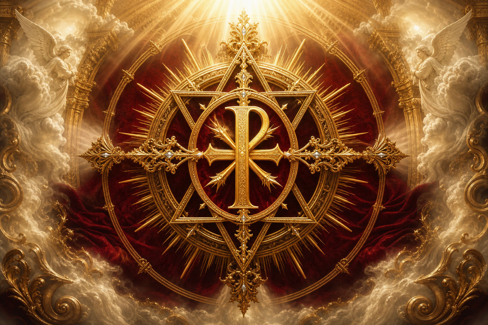

<p align="center">
  
</p>

<h1 align="center">PsychicPrime</h1>

<p align="center">
  <em>A sovereign instrument of discernment — housed within The Sanctuary.</em><br />
  <strong>Through a glass, darkly.</strong> · <em>1 Corinthians 13:12</em>
</p>

<p align="center">
  
  
  
</p>

---

**PsychicPrime** is a private desktop sanctuary for contemplative reading — tarot, astrology, numerology, signal calibration, and life-trajectory discernment — all held beneath **The Rule**: a constitutional conscience that critiques every output before it reaches the soul before you.

Dedicated to the Sacrifice of **Jesus Christ, King of Kings**.  
*Soli Deo Gloria.*

---

## What lives inside The Sanctuary

| Room | What it does |
|------|----------------|
| **◈ Chamber** | Speak with the oracle. Local or cloud LLM via Ollama — or the Sanctuary's own inner light when no Bridge is connected. |
| **✦ Spreads** | Draw tarot as a language of the soul — mirrors, never commands. |
| **☿ Oracle** | Birth chart wheel, numerology, moon phase — the heavens as a symbolic clock. |
| **✶ The Binding** | Twenty-four Solomonic offices of sight, bound under Christ. A faculty council convenes; three roads are named — never one fate. |
| **✝ The Testimony** | Messianic prophecies and their fulfillment — the convergence of all convergences. |
| **◎ Signal Lab** | Falsifiable impressions, recorded before their outcome. |
| **◇ Relics** | Sacred moments kept — readings, synchronicities, dreams. |
| **✧ Constellation** | Your psychic history as a star-map. When many signals point one way, a constellation forms. |
| **⊕ Calibration** | The honest ledger of hits, partials, and misses. |
| **☉ Seekers** | The souls you read for — charts, bonds, and history. |
| **⚖ The Rule** | Homeostat, constitution, robust learning, evolution loop — the Sanctuary's conscience. |

---

## The Binding (Solomonic faculties)

The Lesser Key names seventy-two spirits with fixed offices. PsychicPrime does **not** summon them. It **binds** them — each becomes a bounded reasoning lens, chained beneath the Seal:

```
Seeker + chart + numbers + relic history
        ↓
   Intent routing → which offices to convene
        ↓
   The Seal (The Rule) — must pass before release
        ↓
   Faculty Council → independent impressions
        ↓
   Convergence → three trajectory branches
        ↓
   Falsifiers + free steps → agency returned
```

Every impression is tagged **SEEN** · **FELT** · **SPECULATIVE** (The Veil).  
Every branch can be sealed as a Signal and scored in Calibration.

---

## Tech stack

- **Frontend** — React 19, TypeScript, Vite, Framer Motion, Zustand
- **Desktop** — Tauri 2 (Rust)
- **Storage** — SQLite + FTS5 (local-first; nothing leaves the machine but what you choose to send)
- **Bridge** — Ollama (local or cloud) for the Chamber's outer voice

---

## Download

**Release page:** https://github.com/AaronGrace978/PsychicPrime/releases/tag/v0.1.0

### Steam Deck

**Install from GitHub** (Desktop Mode → Konsole):

```bash
curl -fsSL https://github.com/AaronGrace978/PsychicPrime/releases/download/v0.1.1/install-steamdeck.sh | bash
```

Launch with `~/Applications/PsychicPrime/PsychicPrime.sh` (not the raw AppImage — avoids Steam Deck black screens).  
See [`docs/README-STEAMDECK.md`](docs/README-STEAMDECK.md).

Zip alternative: [PsychicPrime-SteamDeck-0.1.1.zip](https://github.com/AaronGrace978/PsychicPrime/releases/download/v0.1.1/PsychicPrime-SteamDeck-0.1.1.zip)

### Linux desktop (amd64)

| Package | Use |
|---------|-----|
| **AppImage** | Portable — `chmod +x …AppImage && ./…AppImage` |
| **`.deb`** | Debian/Ubuntu — `sudo apt install ./PsychicPrime_0.1.0_amd64.deb` |

Tagged releases publish these via GitHub Actions (`Release Linux`).  
Build locally with `npm run desktop:build`.

### The Gate (phones / LAN / public link)

Run a Sanctuary proxy on your machine — open it from your phone on the same Wi‑Fi, or tunnel it publicly (bostonai.io energy):

```bash
npm run gate:build
# Phone URL printed in the terminal, e.g. http://192.168.x.x:18765

GATE_PUBLIC=1 npm run gate:build   # optional Cloudflare public URL
```

See [`docs/GATE.md`](docs/GATE.md).

---

## Quick start

### Web (development)

```bash
npm install
npm run dev
```

Or double-click `PsychicPrime-Web.bat` on Windows.

### Desktop (Tauri)

Requires [Rust](https://rustup.rs/) and Tauri prerequisites.

```bash
npm install
npm run desktop
```

Or double-click `PsychicPrime.bat`.

### Production build

```bash
npm run build          # web bundle
npm run desktop:build  # native installer
```

---

## Project structure

```
PsychicPrime/
├── src/
│   ├── components/     # Sanctuary UI panels
│   ├── prime/          # Engines — tarot, astro, solomonic, trajectory, governance…
│   ├── store/          # Zustand state
│   └── lib/            # Tauri bridge
├── src-tauri/          # Rust backend — DB, persona, Ollama
└── docs/               # README assets
```

---

## Principles (non-negotiable)

1. **Reverence** — never claim the certainty that belongs to God alone  
2. **Charity** — protect the dignity of the soul before you  
3. **The Veil** — label what is seen, felt, and speculative  
4. **Freedom** — return agency; never coerce, bind, or command  
5. **Hope** — never breed fear, doom, or despair  
6. **Sovereignty** — local-first; your data stays on your machine  

---

## Author

**Aaron Alexander Grace**

---

<p align="center">
  <sub><em>"For now we see through a glass, darkly; but then face to face."</em> — 1 Cor 13:12</sub><br />
  <sub><strong>SOLI DEO GLORIA</strong></sub>
</p>
